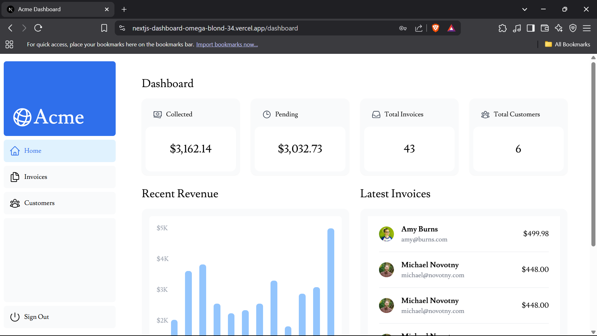

# 📊 Next.js App Router Dashboard


This repository contains the completed project for the official **[Next.js Learn Course](https://nextjs.org/learn)**. It is a full-stack dashboard application built with the Next.js App Router, featuring data fetching, search and pagination, data mutation, and user authentication.

### ✨ [View the Live Demo](https://nextjs-dashboard-omega-blond-34.vercel.app/)



## About This Project

This project was created as a hands-on learning experience to master the core concepts of the Next.js App Router. The course guides you through building a feature-rich dashboard from the ground up.

The application is a simple invoice management system for a fictional company called "Acme".

## 🚀 Key Features & Concepts Learned

This project covers a comprehensive set of modern web development features and best practices:

*   **Next.js App Router:** File-based routing, layouts, nested routes, and error handling.
*   **Data Fetching:** Best practices for fetching, caching, and revalidating data on the server with Server Components.
*   **Streaming & Suspense:** Improving user experience by streaming UI components as data becomes available.
*   **Search & Pagination:** Implementing server-side search and pagination for large datasets using URL Search Params.
*   **Data Mutation:** Handling form submissions with Server Actions to create, update, and delete data.
*   **Authentication:** Adding authentication using `next-auth` to protect routes and manage user sessions.
*   **Styling:** Using Tailwind CSS for a utility-first styling approach and `clsx` for conditional class names.
*   **Database:** Setting up and using Vercel Postgres for the database.
*   **Accessibility:** Ensuring the application is accessible to all users.
*   **Metadata:** SEO optimization using the Metadata API.

## 🛠️ Getting Started Locally

Follow these instructions to set up the project on your local machine for development and testing.

### Prerequisites

*   [Node.js](https://nodejs.org/en/) (v18.17 or later)
*   [pnpm](https://pnpm.io/installation) (you can also use `npm` or `yarn`)

### 1. Clone the Repository

```bash
git clone https://github.com/clementogol/nextjs-dashboard.git
cd nextjs-dashboard
```

### 2. Install Dependencies

```bash
pnpm install
```

### 3. Set Up Environment Variables

This project requires a connection to a Postgres database and an authentication secret.

Copy the .env.example file to a new file named .env.local:

```bash
cp .env.example .env.local
```

Set up a new Postgres database on Vercel.
Once created, copy the POSTGRES_URL connection string into your .env.local file.
Generate a secret for next-auth and add it to AUTH_SECRET:

```bash
# You can use this command in your terminal to generate a secret
openssl rand -base64 32
```

Your .env.local file should look like this:

```env
POSTGRES_URL="postgres://..."
AUTH_SECRET="your-generated-secret-here"
```

### 4. Seed the Database

Run the seeding script to populate your database with initial data (users, invoices, etc.).

```bash
pnpm seed
```

### 5. Run the Development Server

You are now ready to start the development server.

```bash
pnpm dev
```

Open http://localhost:3000 in your browser to see the result. You can log in with the user user@nextmail.com and the password 123456.

## 🌐 Deployment

The easiest way to deploy this application is using the Vercel Platform.
Vercel provides seamless integration with Next.js and will automatically:
- Detect your Next.js project.
- Set up CI/CD pipelines.
- Handle environment variables for production (remember to add your POSTGRES_URL and AUTH_SECRET in the Vercel project settings).

## 🙏 Acknowledgements

A huge thank you to the Vercel and Next.js teams for creating and maintaining this excellent and comprehensive learning resource.
- [Official Next.js Learn Course](https://nextjs.org/learn)
- [Next.js Documentation](https://nextjs.org/docs)
- [Vercel Deployment Platform](https://vercel.com)
